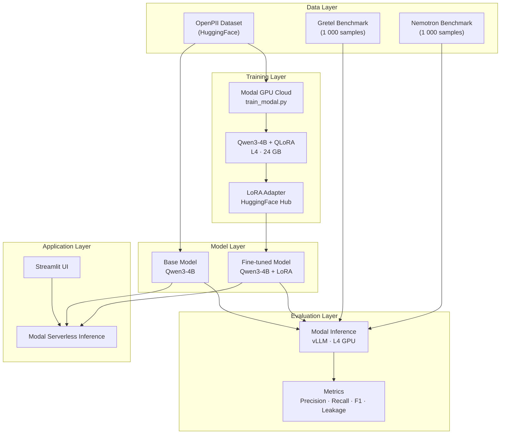
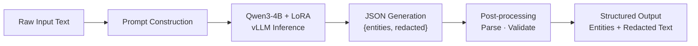

# PrivacyGuard

**Fine-tuned Language Model for PII Detection and Redaction**

[](https://www.python.org/downloads/)
[](https://modal.com)
[](https://huggingface.co/rohitkmr8527/privacyguard-qwen3-4b-qlora)
[](LICENSE)

PrivacyGuard is a **Qwen3-4B** language model fine-tuned with **QLoRA** to detect and redact Personally Identifiable Information (PII) in text. It achieves a **95.4% F1 score** — a **+28.2 pp improvement** over the base model — while reducing PII leakage by **87%**.

---

## Table of Contents

- [Key Results](#key-results)
- [Architecture](#architecture)
- [Dataset & Training](#dataset--training)
- [Evaluation](#evaluation)
- [Demo Application](#demo-application)
- [Installation & Setup](#installation--setup)
- [Usage](#usage)
- [Project Structure](#project-structure)
- [Limitations](#limitations)
- [Future Work](#future-work)
- [License](#license)
- [Acknowledgments](#acknowledgments)

---

## Key Results

| Metric | Base Qwen3-4B | Fine-tuned | Δ |
|--------|:---:|:---:|:---:|
| **Precision** | 72.1% | **95.6%** | +23.5 pp |
| **Recall** | 62.8% | **95.1%** | +32.3 pp |
| **F1 Score** | 67.1% | **95.4%** | +28.2 pp |
| **F2 Score** | 64.5% | **95.2%** | +30.7 pp |
| **PII Leakage Rate** | 37.2% | **4.9%** | −32.3 pp |
| **Over-redaction Rate** | 27.9% | **4.4%** | −23.6 pp |
| **JSON Validity** | 90.0% | **99.8%** | +9.8 pp |

**External Benchmark Generalisation:**

| Benchmark | Base F1 | Fine-tuned F1 | Δ |
|-----------|:---:|:---:|:---:|
| OpenPII (in-domain) | 67.1% | **95.4%** | +28.2 pp |
| Gretel (synthetic) | 84.8% | **85.6%** | +0.8 pp |
| Nemotron (synthetic) | 75.9% | **81.5%** | +5.5 pp |

---

## Architecture

PrivacyGuard is composed of four layers: **Data → Training → Evaluation → Application**.



### Inference Data Flow



**Full architecture diagrams** (training pipeline, evaluation pipeline, QLoRA internals, module map): [`docs/architecture_diagrams.md`](docs/architecture_diagrams.md)

---

## Dataset & Training

### OpenPII Dataset

- **Source**: [`ai4privacy/OpenPII`](https://huggingface.co/datasets/ai4privacy/OpenPII)
- **Splits**: Train 10 000 / Validation 1 000 / Test 3 000
- **Entity Types (18)**: `PERSON`, `EMAIL`, `PHONENUMBER`, `USERNAME`, `ACCOUNTNUMBER`, `SSN`, `DRIVERLICENSE`, `CREDITCARD`, `PASSPORT`, `IBAN`, `BITCOIN`, `IP_ADDRESS`, `URL`, `STREET_ADDRESS`, `CITY`, `STATE`, `ZIPCODE`, `DATE_OF_BIRTH`

### Instruction Format

The model is trained to produce structured JSON output:

```json
{
  "entities": [
    {"entity": "John Smith",       "label": "PERSON"},
    {"entity": "john@example.com", "label": "EMAIL"}
  ],
  "redacted": "{{PERSON}} can be reached at {{EMAIL}}"
}
```

### Training Configuration

| Parameter | Value |
|-----------|-------|
| Base Model | `Qwen/Qwen3-4B` |
| Method | QLoRA (4-bit NF4 quantisation) |
| LoRA Rank | 16 |
| Target Modules | q_proj, k_proj, v_proj, o_proj, gate_proj, up_proj, down_proj |
| Effective Batch Size | 16 (2 per device × 8 gradient accumulation steps) |
| Learning Rate | 3e-4 |
| Max Sequence Length | 2 048 tokens |
| Epochs | 3 |
| GPU | L4 (24 GB) on Modal |
| Training Time | ~3 hours |
| Optimiser | `paged_adamw_8bit` |
| LR Scheduler | Cosine with 3% warmup |

**Optimisations:** Flash Attention 2 · 4-bit NF4 quantisation · bfloat16 compute · gradient checkpointing · mixed-precision training

---

## Evaluation

### Metrics

| Category | Metrics |
|----------|---------|
| Detection | Precision, Recall, F1, F2 (recall-weighted, β=2) |
| Privacy Risk | PII Leakage Rate (FN / total true), Over-redaction Rate (FP / total predicted) |
| Output Quality | JSON Validity %, Entity-level F1 per type |

### Inference Setup

- **Engine**: vLLM with Flash Attention 2
- **GPU**: L4 (Modal cloud)
- **Temperature**: 0.0 (deterministic)
- **Max New Tokens**: 384

### Entity-Level Performance (Fine-tuned)

**Top performers (F1 > 95%):**
`CREDITCARD` 98.5% · `PHONENUMBER` 98.2% · `EMAIL` 97.8% · `ACCOUNTNUMBER` 97.4% · `SSN` 96.8% · `USERNAME` 96.3% · `PASSPORT` 95.7%

**Challenging entities (F1 < 90%):**
`CITY` 87.3% · `STATE` 88.9% · `ZIPCODE` 89.2% — harder due to context ambiguity and format variation.

---

## Demo Application

An interactive Streamlit app for real-time PII detection with model comparison.

```bash
# 1. Authenticate with Modal
uv run modal setup

# 2. Launch the demo
uv run streamlit run app/streamlit_app.py
```

Open `http://localhost:8501` in your browser.

**Features:**
- Paste or type text to detect PII instantly
- Switch between base and fine-tuned model
- View detected entity list, redacted text, and raw JSON
- Side-by-side model comparison
- Processing time and token count stats

---

## Installation & Setup

### Prerequisites

| Requirement | Details |
|-------------|---------|
| Python | 3.12 or newer |
| Package manager | [`uv`](https://docs.astral.sh/uv/) |
| Cloud GPU | [Modal](https://modal.com) account |
| Model hosting | [HuggingFace](https://huggingface.co) account |

### Steps

```bash
# 1. Clone the repository
git clone https://github.com/rohitkr8527/privacygaurd.git
cd privacygaurd

# 2. Install uv (if not already installed)
curl -LsSf https://astral.sh/uv/install.sh | sh

# 3. Sync project dependencies
uv sync

# 4. Authenticate with Modal
uv run modal setup

# 5. Set up environment variables
cp .env.example .env
# Edit .env and add your HuggingFace token if needed
```

---

## Usage

### 1. Data Preparation

```bash
# Inspect the dataset
uv run python src/data/inspect_dataset.py

# Create train/val/test splits → saved to data/processed/
uv run python src/data/prepare_dataset.py
```

### 2. Training (Optional)

The model is already published on HuggingFace. To retrain from scratch:

```bash
# Launch training job on Modal L4 (~3 h, ~$3–5)
uv run modal run training/train_modal.py
```

### 3. Evaluation

```bash
# Base model evaluation
uv run modal run evaluation/baseline_modal.py

# Fine-tuned model evaluation
uv run modal run evaluation/finetuned_modal.py

# External benchmark evaluation
uv run python evaluation/prepare_external_benchmarks.py
uv run modal run evaluation/external_eval_modal.py
uv run python evaluation/analyze_external_results.py

# Generate result figures
uv run python evaluation/create_figures.py
```

### 4. Error & Leakage Analysis

```bash
uv run python evaluation/error_analysis.py
uv run python evaluation/audit_leakage.py
```

### 5. Launch Demo

```bash
uv run streamlit run app/streamlit_app.py
# → http://localhost:8501
```

---

## Project Structure

```
privacygaurd/
├── app/
│   ├── streamlit_app.py          # Interactive Streamlit demo
│   └── modal_inference.py        # Modal serverless inference client
├── data/
│   ├── processed/                # train.jsonl · val.jsonl · test.jsonl
│   └── external/                 # gretel_test_1000.jsonl · nemotron_test_1000.jsonl
├── docs/
│   └── architecture_diagrams.md  # Full Mermaid architecture diagrams
├── evaluation/
│   ├── baseline_modal.py         # Base model evaluation (Modal)
│   ├── finetuned_modal.py        # Fine-tuned model evaluation (Modal)
│   ├── external_eval_modal.py    # External benchmark evaluation
│   ├── prepare_external_benchmarks.py
│   ├── metrics.py                # Precision · Recall · F1 · Leakage calculations
│   ├── analyze_external_results.py
│   ├── compare_results.py
│   ├── error_analysis.py
│   ├── audit_leakage.py
│   └── create_figures.py         # Result visualisation generation
├── results/
│   ├── baseline_metrics.json
│   ├── finetuned_metrics.json
│   ├── baseline_vs_finetuned.json
│   ├── entity_metrics.json
│   ├── error_analysis.json
│   ├── leakage_audit.json
│   ├── external/                 # External benchmark results
│   └── figures/                  # Generated PNG charts
├── src/
│   ├── data/
│   │   ├── inspect_dataset.py
│   │   └── prepare_dataset.py
│   └── privacygaurd/
│       └── __init__.py
├── training/
│   └── train_modal.py            # QLoRA fine-tuning job (Modal L4)
├── .env.example
├── pyproject.toml
└── README.md
```

---

## Limitations

| Limitation | Detail |
|------------|--------|
| **Context window** | Max 2 048 tokens (~1 500 words). Long documents require chunking; cross-chunk entity resolution is not implemented. |
| **Language** | Trained on English text only. Non-English and non-Latin script performance is not evaluated. |
| **Domain shift** | ~9–10 pp F1 drop on external benchmarks vs in-domain. May need adaptation for specialised text. |
| **Entity types** | Fixed to 18 predefined categories. Custom or emerging PII types require retraining. |
| **Residual leakage** | 4.9% PII leakage rate. Not suitable for zero-tolerance environments without additional safeguards. |
| **JSON dependency** | ~0.2% generation failures. Fallback parsing strategies recommended for critical applications. |

**Recommended mitigations:** sliding-window chunking · ensemble with rule-based systems · human review for low-confidence predictions · periodic retraining · multi-model voting for high-stakes use cases.

---

## Future Work

- **Extended context**: Support 8 K+ token windows for long documents
- **Multilingual**: Fine-tune on multilingual PII datasets
- **Confidence scores**: Per-entity confidence estimation for flagging uncertain predictions
- **Hierarchical entities**: Nested entity detection (e.g., address components)
- **Model compression**: Quantised/distilled models for edge deployment
- **Batch API**: Async batch processing for large-scale pipelines
- **Active learning**: Human-in-the-loop feedback for continuous improvement
- **Differential privacy**: Formal privacy guarantees during training

---

## License

This project is licensed under the **MIT License** — see [`LICENSE`](LICENSE) for details.

**Model licence**: The fine-tuned adapter inherits the [Qwen3 Licence](https://huggingface.co/Qwen/Qwen3-4B).

---

## Acknowledgments

- **Qwen Team** — Qwen3-4B base model
- **ai4privacy** — OpenPII dataset
- **Modal** — Cloud GPU infrastructure
- **vLLM Team** — Fast inference engine
- **HuggingFace** — Model hosting and transformers library

---

**Model on HuggingFace**: [rohitkmr8527/privacyguard-qwen3-4b-qlora](https://huggingface.co/rohitkmr8527/privacyguard-qwen3-4b-qlora)
