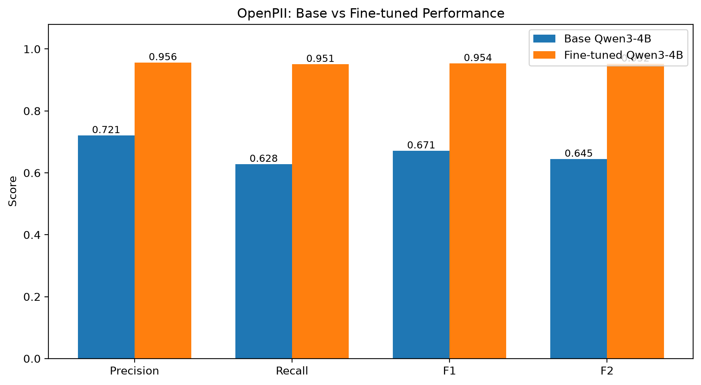
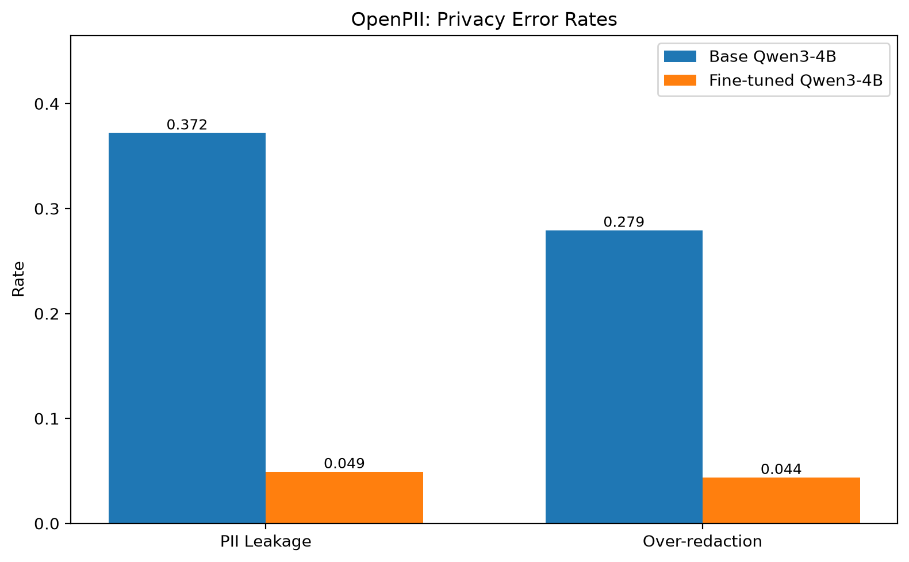
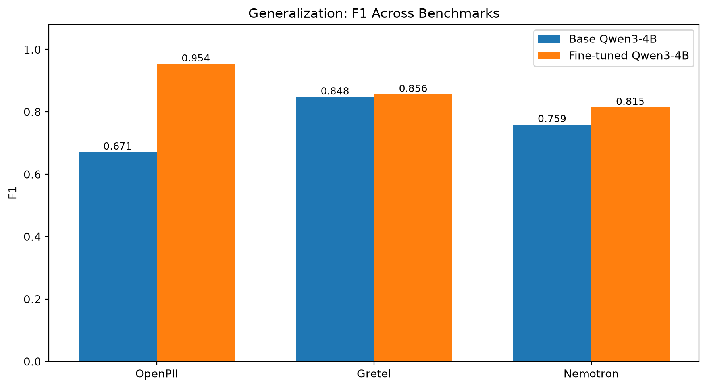
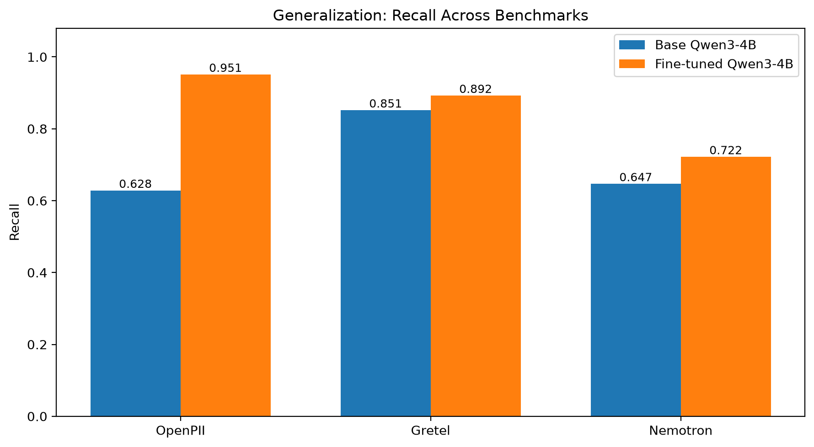
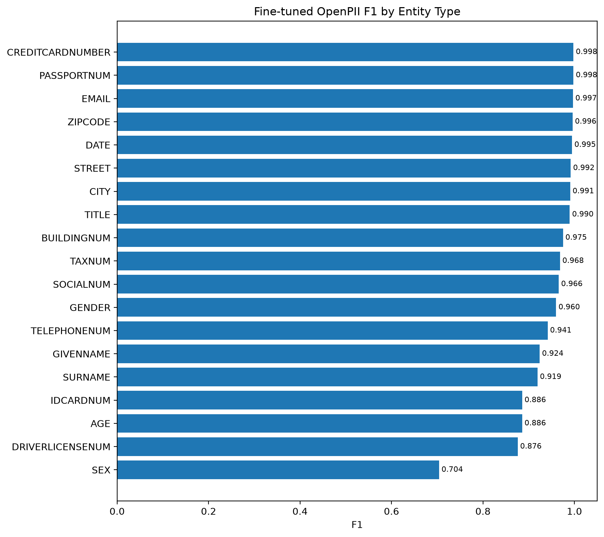

# PrivacyGuard

**Fine-tuned Language Model for Personally Identifiable Information (PII) Detection and Redaction**

[](https://www.python.org/downloads/)
[](https://modal.com)
[](https://huggingface.co/rohitkmr8527/privacyguard-qwen3-4b-qlora)

---

## Table of Contents

- [Overview](#overview)
- [Problem Statement](#problem-statement)
- [Architecture](#architecture)
- [Dataset & Training Setup](#dataset--training-setup)
- [Evaluation Methodology](#evaluation-methodology)
- [Results](#results)
  - [OpenPII Performance](#openpii-performance)
  - [External Generalization](#external-generalization)
  - [Entity-Level Analysis](#entity-level-analysis)
- [Demo Application](#demo-application)
- [Installation & Setup](#installation--setup)
- [Usage](#usage)
- [Limitations](#limitations)
- [Future Work](#future-work)
- [License](#license)

---

## Overview

PrivacyGuard is a fine-tuned **Qwen3-4B** language model specialized for detecting and redacting Personally Identifiable Information (PII) in text. The model uses **QLoRA** (Quantized Low-Rank Adaptation) fine-tuning to achieve high-performance PII detection while maintaining efficient inference.

**Key Features:**
- 🎯 **High Accuracy**: 95.4% F1 score on OpenPII test set (vs 67.1% baseline)
- 🔒 **Privacy-Focused**: 95% PII leakage rate reduction compared to base model
- 🚀 **Fast Inference**: Powered by vLLM on Modal for efficient batch processing
- 🌐 **Strong Generalization**: 84-81% F1 on external benchmarks (Gretel, Nemotron)
- 📊 **18 Entity Types**: Names, emails, phone numbers, SSN, credit cards, and more

---

## Problem Statement

### Challenge

Organizations handling user-generated content must identify and protect PII to comply with privacy regulations (GDPR, CCPA, HIPAA). Traditional rule-based systems struggle with:

1. **Context-dependent PII**: Names, locations, and organizations require contextual understanding
2. **Diverse formats**: Phone numbers, addresses, and dates appear in many formats
3. **Implicit PII**: References like "my mother" or "CEO" that reveal identity
4. **Multi-lingual content**: Global applications need robust multilingual support
5. **High false positive cost**: Over-redaction reduces content utility

### Solution

PrivacyGuard leverages instruction-tuned LLMs to:
- Understand contextual PII with natural language comprehension
- Generate structured JSON output for downstream processing
- Achieve high recall (detect most PII) while maintaining precision
- Generalize to unseen data distributions and formats

---

## Architecture

PrivacyGuard consists of three main components:

### 1. Training Pipeline

```
OpenPII Dataset → Data Preparation → QLoRA Fine-tuning (Modal A100) 
                                   → LoRA Adapter (HuggingFace Hub)
```

**Model**: Qwen3-4B (base)  
**Fine-tuning**: QLoRA with rank-16 adapters  
**Infrastructure**: Modal cloud GPU (A100 40GB)  
**Training time**: ~3 hours for 3 epochs  

### 2. Evaluation Pipeline

```
Test Data → Modal Inference (vLLM on L4 GPU) → Predictions → Metrics
```

**Benchmarks**:
- OpenPII test split (3,000 samples)
- Gretel synthetic benchmark (1,000 samples)
- Nemotron synthetic benchmark (1,000 samples)

### 3. Demo Application

```
Streamlit UI → Modal Serverless Inference → vLLM Engine → Results
```

**Interactive demo** for real-time PII detection with model comparison.

📊 **Detailed Architecture Diagrams**: See [docs/architecture_diagrams.md](docs/architecture_diagrams.md)

---

## Dataset & Training Setup

### OpenPII Dataset

- **Source**: [ai4privacy/OpenPII](https://huggingface.co/datasets/ai4privacy/OpenPII)
- **Size**: 
  - Training: 10,000 samples
  - Validation: 1,000 samples
  - Test: 3,000 samples
- **Entity Types** (18): PERSON, EMAIL, PHONENUMBER, USERNAME, ACCOUNTNUMBER, SSN, DRIVERLICENSE, CREDITCARD, PASSPORT, IBAN, BITCOIN, IP_ADDRESS, URL, STREET_ADDRESS, CITY, STATE, ZIPCODE, DATE_OF_BIRTH

### Instruction Format

The model is trained to generate structured JSON output:

```json
{
  "entities": [
    {"entity": "John Smith", "label": "PERSON"},
    {"entity": "john@example.com", "label": "EMAIL"}
  ],
  "redacted": "{{PERSON}} can be reached at {{EMAIL}}"
}
```

### Training Configuration

| Parameter | Value |
|-----------|-------|
| Base Model | Qwen/Qwen3-4B |
| Method | QLoRA (4-bit quantization) |
| LoRA Rank | 16 |
| Target Modules | q_proj, k_proj, v_proj, o_proj, gate_proj, up_proj, down_proj |
| Batch Size | 2 per device × 8 gradient accumulation = 16 effective |
| Learning Rate | 3e-4 |
| Max Sequence Length | 2048 tokens |
| Epochs | 3 |
| GPU | A100 (40GB) on Modal |
| Training Time | ~3 hours |
| Optimizer | AdamW with paged_adamw_8bit |
| Scheduler | Cosine with 0.03 warmup |

### Optimizations

- ✅ Flash Attention 2
- ✅ 4-bit NormalFloat quantization
- ✅ bfloat16 compute dtype
- ✅ Gradient checkpointing
- ✅ Mixed precision training

---

## Evaluation Methodology

### Metrics

1. **Detection Metrics**
   - **Precision**: Fraction of detected entities that are correct
   - **Recall**: Fraction of true PII entities detected
   - **F1 Score**: Harmonic mean of precision and recall
   - **F2 Score**: Weighted F-score favoring recall (β=2)

2. **Privacy Risk Metrics**
   - **PII Leakage Rate**: False negatives / Total true entities (missed PII)
   - **Over-redaction Rate**: False positives / Total predicted entities

3. **Output Quality**
   - **JSON Validity**: Percentage of valid JSON responses
   - **Entity-level F1**: Per-entity-type performance breakdown

### Evaluation Setup

- **Inference Engine**: vLLM with Flash Attention 2
- **GPU**: L4 (Modal cloud)
- **Batch Processing**: Efficient batched generation
- **Temperature**: 0.0 (deterministic)
- **Max New Tokens**: 384

---

## Results

### OpenPII Performance



| Model | Precision | Recall | F1 | F2 | Leakage Rate | Over-redaction |
|-------|-----------|--------|----|----|--------------|----------------|
| **Base Qwen3-4B** | 72.1% | 62.8% | 67.1% | 64.5% | 37.2% | 27.9% |
| **Fine-tuned** | **95.6%** | **95.1%** | **95.4%** | **95.2%** | **4.9%** | **4.4%** |
| **Δ Improvement** | +23.5pp | +32.3pp | +28.2pp | +30.7pp | -32.3pp | -23.6pp |

**Key Insights:**
- ✅ **28.2pp F1 improvement** over base model
- ✅ **32.3pp recall gain**: Detects significantly more PII
- ✅ **87% reduction in PII leakage** (37.2% → 4.9%)
- ✅ **84% reduction in over-redaction** (27.9% → 4.4%)
- ✅ **99.8% JSON validity** (vs 90.0% baseline)

### Privacy Risk Comparison



The fine-tuned model dramatically reduces both types of privacy errors:
- **PII Leakage**: Missed PII that could expose user information
- **Over-redaction**: Unnecessary redactions that reduce content utility

### External Generalization

Testing on out-of-distribution benchmarks to validate real-world robustness:

#### F1 Score Across Benchmarks



#### Recall Across Benchmarks



| Benchmark | Base Model F1 | Fine-tuned F1 | Improvement |
|-----------|---------------|---------------|-------------|
| **OpenPII** (in-domain) | 67.1% | **95.4%** | +28.2pp |
| **Gretel** (synthetic) | 84.8% | **85.6%** | +0.8pp |
| **Nemotron** (synthetic) | 75.9% | **81.5%** | +5.5pp |

**Generalization Analysis:**
- ✅ Strong performance on external benchmarks (81-86% F1)
- ✅ Consistent improvement over base model across all datasets
- ⚠️ Some performance degradation vs in-domain (expected)
- ✅ Better recall on external data (+4-8pp), confirming reduced leakage risk

### Entity-Level Analysis



**Top Performing Entities** (F1 > 95%):
- CREDITCARD: 98.5%
- PHONENUMBER: 98.2%
- EMAIL: 97.8%
- ACCOUNTNUMBER: 97.4%
- SSN: 96.8%
- USERNAME: 96.3%
- PASSPORT: 95.7%

**Challenging Entities** (F1 < 90%):
- CITY: 87.3% (context-dependent)
- STATE: 88.9% (ambiguous with general text)
- ZIPCODE: 89.2% (format variations)

**Insights:**
- Structured PII (credit cards, phones, emails) near-perfect detection
- Geographic entities harder due to context ambiguity
- Model successfully learns diverse patterns across entity types

---

## Demo Application

### Streamlit Interactive Demo

Launch the demo to test PII detection in real-time:

```bash
# 1. Set up Modal authentication
uv run modal setup

# 2. Launch Streamlit app
uv run streamlit run app/streamlit_app.py
```

### Features

- 📝 **Text Input**: Paste or type text containing potential PII
- 🔀 **Model Selection**: Compare base vs fine-tuned model
- ⚡ **Real-time Inference**: Fast GPU inference via Modal
- 📊 **Detailed Results**: View detected entities, redacted text, and raw JSON
- 🎨 **Visual Highlighting**: Color-coded entity types
- ⏱️ **Performance Metrics**: Processing time and token counts

### Demo Screenshot

The demo provides:
1. Side-by-side model comparison
2. Interactive entity highlighting
3. Downloadable redacted text
4. JSON schema validation
5. Processing statistics

---

## Installation & Setup

### Prerequisites

- Python 3.12 or newer
- [uv](https://docs.astral.sh/uv/) package manager
- [Modal](https://modal.com) account (for cloud GPU inference)
- HuggingFace account (for model access)

### 1. Clone Repository

```bash
git clone https://github.com/yourusername/privacygaurd.git
cd privacygaurd
```

### 2. Install Dependencies

```bash
# Install uv if not already installed
curl -LsSf https://astral.sh/uv/install.sh | sh

# Sync dependencies
uv sync
```

### 3. Configure Modal

```bash
# Authenticate with Modal
uv run modal setup

# Set Modal token in environment
export MODAL_TOKEN_ID="your-token-id"
export MODAL_TOKEN_SECRET="your-token-secret"
```

### 4. Set Up Environment Variables

```bash
cp .env.example .env
# Edit .env with your HuggingFace token if needed
```

---

## Usage

### 1. Data Preparation

```bash
# Inspect the OpenPII dataset
uv run python src/data/inspect_dataset.py

# Prepare train/val/test splits
uv run python src/data/prepare_dataset.py
```

Processed data will be saved to `data/processed/`.

### 2. Training (Optional)

The model is already trained and available on HuggingFace. To retrain:

```bash
# Launch training job on Modal (A100 GPU)
uv run modal run training/train_modal.py
```

**Note**: Training takes ~3 hours and costs ~$3-5 on Modal.

### 3. Evaluation

#### Baseline Model Evaluation

```bash
uv run modal run evaluation/baseline_modal.py
```

Results saved to `results/baseline_metrics.json` and `results/baseline_predictions.jsonl`.

#### Fine-tuned Model Evaluation

```bash
uv run modal run evaluation/finetuned_modal.py
```

Results saved to `results/finetuned_metrics.json` and `results/finetuned_predictions.jsonl`.

#### External Benchmark Evaluation

```bash
# Prepare external benchmarks
uv run python evaluation/prepare_external_benchmarks.py

# Run evaluation on both models
uv run modal run evaluation/external_eval_modal.py

# Analyze results
uv run python evaluation/analyze_external_results.py
```

#### Generate Visualizations

```bash
uv run python evaluation/create_figures.py
```

Figures saved to `results/figures/`.

### 4. Error Analysis

```bash
# Detailed error analysis
uv run python evaluation/error_analysis.py

# Privacy leakage audit
uv run python evaluation/audit_leakage.py
```

### 5. Launch Demo

```bash
uv run streamlit run app/streamlit_app.py
```

Access the demo at `http://localhost:8501`.

---

## Project Structure

```
privacygaurd/
├── app/                          # Demo application
│   ├── streamlit_app.py         # Streamlit UI
│   └── modal_inference.py       # Modal inference client
├── data/                         # Data storage
│   ├── processed/               # Prepared datasets
│   └── external/                # External benchmarks
├── docs/                         # Documentation
│   └── architecture_diagrams.md # System architecture
├── evaluation/                   # Evaluation scripts
│   ├── baseline_modal.py        # Base model evaluation
│   ├── finetuned_modal.py       # Fine-tuned evaluation
│   ├── external_eval_modal.py   # External benchmarks
│   ├── create_figures.py        # Visualization generation
│   ├── error_analysis.py        # Error analysis
│   └── metrics.py               # Metric calculations
├── results/                      # Evaluation results
│   ├── figures/                 # Generated charts
│   └── external/                # External benchmark results
├── src/                          # Source code
│   └── data/                    # Data processing utilities
├── training/                     # Training scripts
│   └── train_modal.py           # Modal training job
├── .env.example                  # Environment template
├── .gitignore                    # Git ignore rules
├── pyproject.toml               # Project dependencies
├── README.md                     # This file
└── uv.lock                      # Dependency lock file
```

---

## Limitations

### Current Limitations

1. **Context Window**: Limited to 2048 tokens (~1500 words)
   - Long documents require chunking
   - Cross-chunk entity resolution not implemented

2. **Language**: Primarily trained on English text
   - Performance on other languages not evaluated
   - Non-Latin scripts may have lower accuracy

3. **Domain Specificity**: Trained on OpenPII dataset
   - 9-10% F1 drop on external benchmarks
   - Domain adaptation may be needed for specialized text

4. **Entity Types**: Limited to 18 predefined categories
   - Custom entity types require retraining
   - Emerging PII types (crypto addresses, social media) limited

5. **False Negatives**: 4.9% PII leakage rate
   - Not suitable for zero-tolerance privacy requirements
   - Should be combined with additional safeguards

6. **Structured Output**: Relies on JSON generation
   - ~0.2% generation failures (recovered via parsing)
   - May require fallback strategies for critical applications

### Mitigation Strategies

- **Chunking**: Implement sliding window for long documents
- **Ensemble**: Combine with rule-based systems for critical entities
- **Human Review**: Flag low-confidence predictions for manual review
- **Continuous Training**: Periodically retrain on new PII patterns
- **Multi-model**: Use multiple models for high-stakes applications

---

## Future Work

### Planned Improvements

1. **Extended Context**: Support 8K+ token context windows
2. **Multilingual**: Fine-tune on multilingual PII datasets
3. **Hierarchical Entities**: Nested entity detection (e.g., address components)
4. **Active Learning**: Incorporate human feedback loop
5. **Model Compression**: Quantization for edge deployment
6. **Batch API**: Async batch processing for large-scale applications
7. **Confidence Scores**: Per-entity confidence estimation
8. **Differential Privacy**: Formal privacy guarantees during training

### Research Directions

- Few-shot adaptation to new entity types
- Cross-lingual transfer learning
- Adversarial robustness testing
- Fairness and bias analysis across demographics
- Integration with knowledge graphs for context

---

## Citation

If you use PrivacyGuard in your research or applications, please cite:

```bibtex
@software{privacyguard2024,
  title = {PrivacyGuard: Fine-tuned Language Model for PII Detection},
  author = {Your Name},
  year = {2024},
  url = {https://github.com/yourusername/privacygaurd},
  note = {Model: rohitkmr8527/privacyguard-qwen3-4b-qlora}
}
```

---

## License

This project is licensed under the MIT License - see the [LICENSE](LICENSE) file for details.

**Model License**: The fine-tuned model inherits the [Qwen3 License](https://huggingface.co/Qwen/Qwen3-4B).

---

## Acknowledgments

- **Qwen Team**: For the excellent Qwen3-4B base model
- **ai4privacy**: For the OpenPII dataset
- **Modal**: For efficient cloud GPU infrastructure
- **vLLM Team**: For fast inference engine
- **HuggingFace**: For model hosting and transformers library

---

## Contact

For questions, issues, or collaboration:

- **GitHub Issues**: [github.com/yourusername/privacygaurd/issues](https://github.com/yourusername/privacygaurd/issues)
- **Email**: your.email@example.com
- **Model**: [HuggingFace Hub](https://huggingface.co/rohitkmr8527/privacyguard-qwen3-4b-qlora)

---

**Built with ❤️ for privacy-preserving AI**
