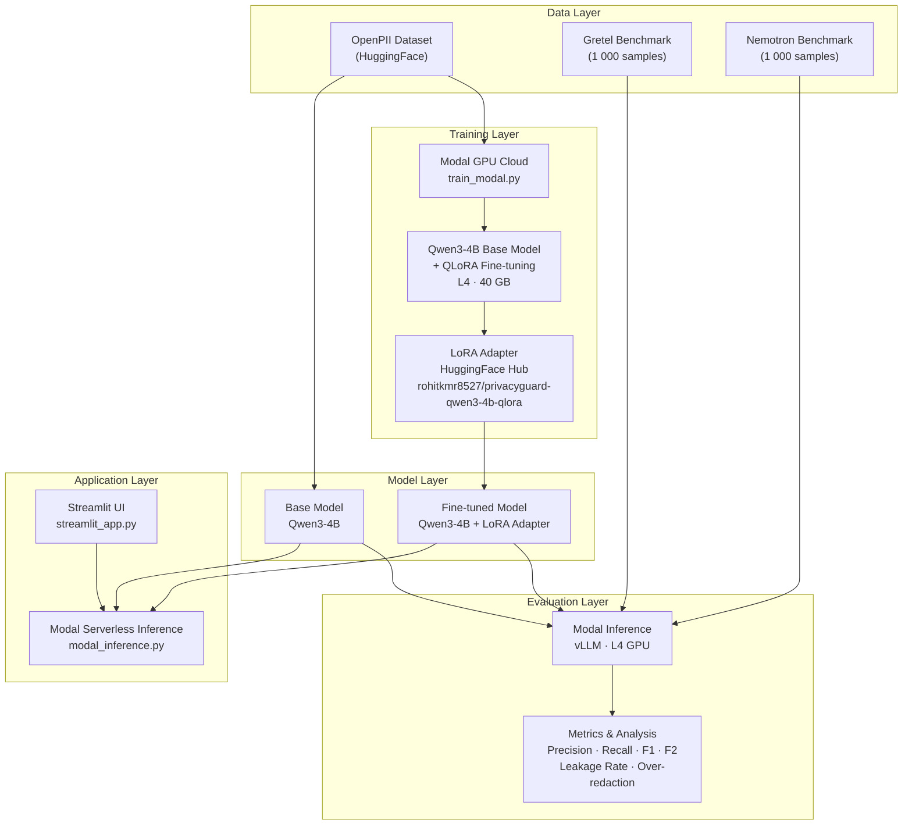
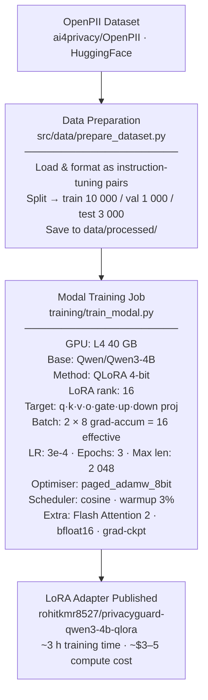
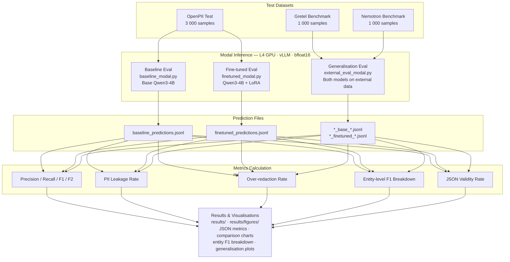
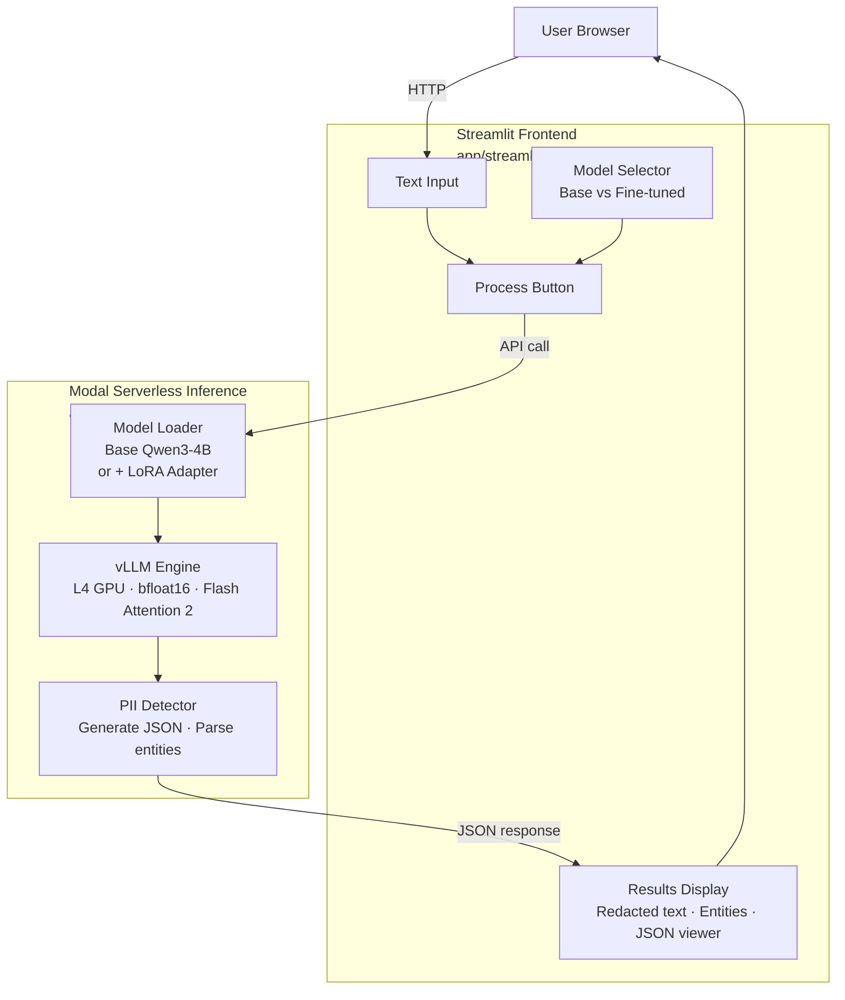
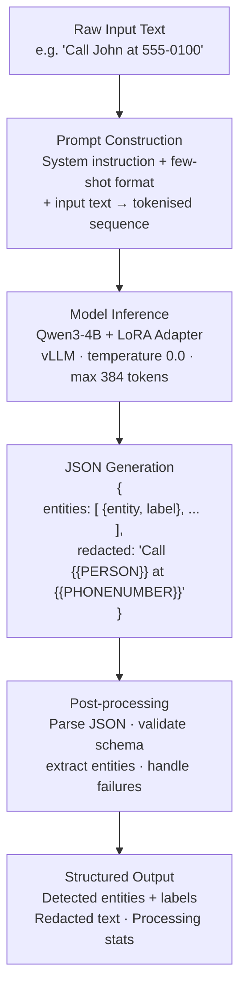
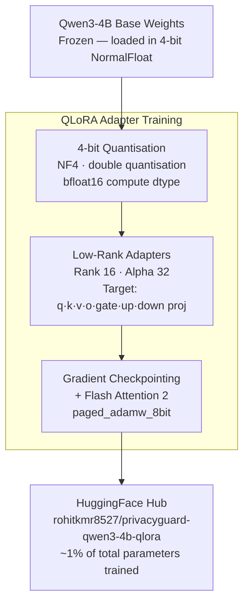
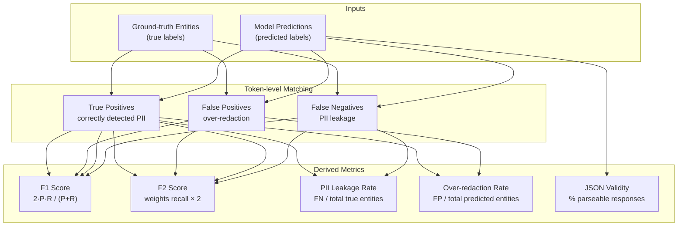
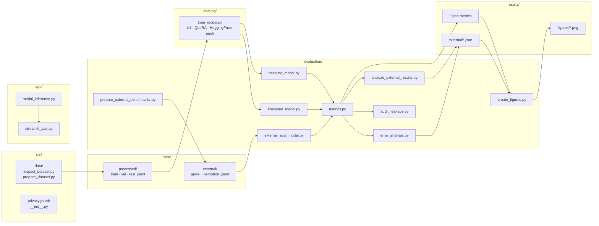

# PrivacyGuard — Architecture Diagrams

> All diagrams use [Mermaid](https://mermaid.js.org/) and render natively on GitHub and most modern Markdown viewers.

---

## 1. System Architecture Overview

High-level view of the four layers that make up PrivacyGuard.

---

## 2. Training Pipeline

End-to-end flow from raw data to a published LoRA adapter.

---

## 3. Evaluation Pipeline

Parallel evaluation of base and fine-tuned models across three datasets.

---

## 4. Demo Application Architecture

Request / response flow from the browser through to GPU inference.

---

## 5. Inference Data Flow

Step-by-step transformation of raw input text into structured PII results.

---

## 6. QLoRA Fine-tuning Detail

Internal mechanics of the quantisation and adapter training process.

---

## 7. Metrics & Evaluation Framework

Relationships between predictions, ground truth, and computed metrics.

---

## 8. Project Module Map

Relationship between source modules and their responsibilities.

